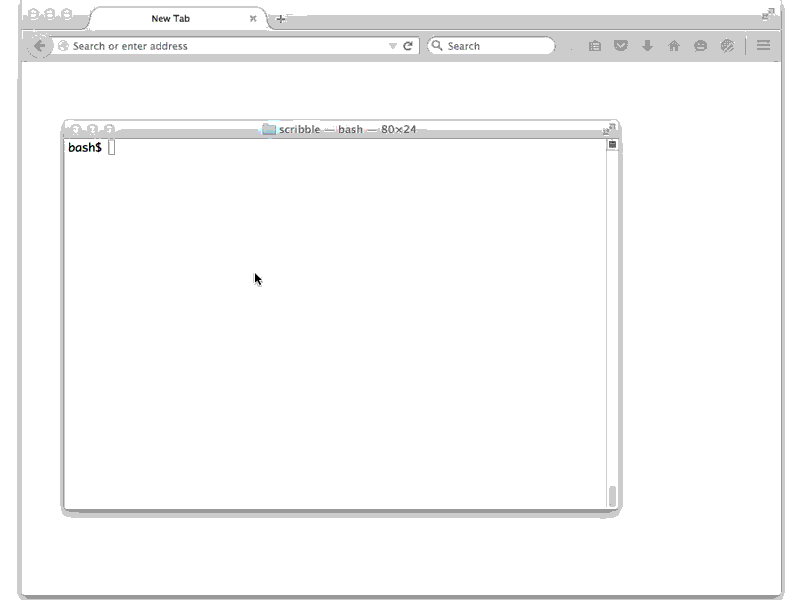

# VNC platform plugin for Qt 5

This fork contains a VNC platform plugin which lets you run any Qt app in
headless mode and access it with a VNC client. It has builtin websocket
support for pure HTML5 VNC clients like [noVNC](http://novnc.com).

You can view Qt apps in a browser just by navigating to http://host:5900

## Build

The default `./configure` will build the VNC plugin. Use `--no-vnc` to disable
building the VNC plugin. Your Qt application must be built with this Qt
library.

## Usage

You can control the platform using environment variables or CLI options.
In the shell,

    export QT_QPA_PLATFORM=vnc
    export QT_DEBUG_PLUGINS=1

before starting the application. Alternately, invoke the application with

    /path/to/qtapp -platform vnc

For MacOS app bundles, this may be modified to

    /path/to/qtapp.app/Contents/MacOS/qtapp -platform vnc

That's pretty much it. You should see messages appearing on the console, like

    QVNCServer created on "127.0.0.1" port 5900 mode websocket
  
Navigate to http://localhost:5900 on any modern browser and you should be
able to view and interact with the application.

## Options

Platform options can be supplied with the `-platform` command line option 
or the `QT_QPA_PLATFORM` environment variable. The platform string starts with
`vnc` and a combination of the following options, separated by colons.

  * `size=<width>x<height>` Width and height of the frame buffer.
    * Default: `size=800x600`
  * `display=<num>` VNC display number. Server listens to port 5900 + `<num>`
    * Default: `display=0`
  * `addr=<IP>` IPv4 address on which the server listens.
    * Example: `addr=0.0.0.0` listens on all interfaces
    * Default: `addr=127.0.0.1`
  * `mode=<str>` One of `websocket` or `raw`. Use `websocket` to connect with
    a browser-based HTML5 VNC viewer, or `raw` to use a regular VNC client like
    _vncviewer_ or _Chicken of the VNC_.
    * Default: `mode=websocket`
  * `viewer=<URL>` Sets the location of the HTML5 VNC viewer. In `websocket`
    mode, any regular HTTP request to the listening port will be issued an HTTP
    redirect to the viewer URL, appended with a hash fragment containing
    host and port parameters. Websocket requests from other origins are
    rejected. Note that the colon needs to be URL-encoded since Qt uses it as
    an option separator. Websocket requests from origins other than the viewer
    will be rejected.
    * Default: `viewer=http%3A//pigshell.github.io/noVNC/qtvnc.html`
  * `maximize=<bool>` Maximize first window. Without this option, apps which
    don't maximize themselves usually occupy a small window at the top left
    of the frame buffer.
    * Default: `maximize=true`

## Gotchas

  * Does not support authentication.
  * Does not support SSL.
  * Does not build on Windows.
  * If running examples on MacOS, you need to do a `make install` first.
    Otherwise you need to copy the $QTBASE/plugins/platforms directory into
    QtAppName.app/Contents/MacOS/, where $QTBASE is the directory containing
    this (built) Qt repo.
